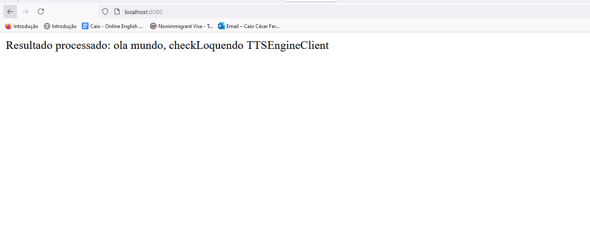

# Documentação do Projeto

## Pré-requisitos para Compilar o Projeto

- **Java 17**
- **Maven 3**

## Descrição do Projeto

Este projeto consiste em adicionar uma dependência externa de um fornecedor a uma biblioteca e integrá-la a um projeto Spring Boot que expõe um controller.

## Passos para Compilar e Executar

### 1. Instalação da Dependência Externa na Biblioteca

Primeiro, navegue até o diretório da biblioteca (`minhaBib`) e execute os seguintes comandos:

```bash
cd minhaBib
mvn install:install-file -Dfile=LTTS7EngineClient.jar -DgroupId=com.loquendo -DartifactId=loquendoLib -Dversion=1.0.0 -Dpackaging=jar -DgeneratePom=true
mvn clean install
```

### 2. Compilação e Execução do Projeto Spring Boot

Depois de configurar a biblioteca, entre no diretório do projeto Spring Boot (`demoweb`) e execute os seguintes comandos:

```bash
cd ../demoweb
mvn clean install
mvn spring-boot:run
```

### 3. Acessando a Aplicação

Após a execução do comando acima, a aplicação estará disponível em:

[http://localhost:8080/](http://localhost:8080/)

### Resultado Esperado
```
Olá mundo, checkLoquendo TTSEngineClient
```

Ao acessar a aplicação, o resultado processado deverá ser:

